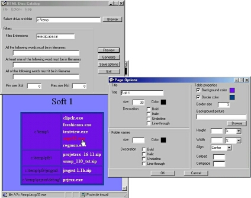

## HTML Disk Catalog

### Description

generate a html page listing all files in directories and drives. You can search file extensions you want. Options are also available to choose color of text and link or background picture. Included document launcher to make autorun for documents (html,doc ....)
 
### More Info
 

             |
---                |---
**Submitted On**   |2001-12-06 18:21:02
**By**             |[POTIER Jacquelin](https://github.com/Planet-Source-Code/PSCIndex/blob/master/ByAuthor/potier-jacquelin.md)
**Level**          |Beginner
**User Rating**    |4.0 (8 globes from 2 users)
**Compatibility**  |VB 6\.0
**Category**       |[Complete Applications](https://github.com/Planet-Source-Code/PSCIndex/blob/master/ByCategory/complete-applications__1-27.md)
**World**          |[Visual Basic](https://github.com/Planet-Source-Code/PSCIndex/blob/master/ByWorld/visual-basic.md)
**Archive File**   |[HTML\_Disk\_400811272001\.zip](https://github.com/Planet-Source-Code/potier-jacquelin-html-disk-catalog__1-29560/archive/master.zip)

